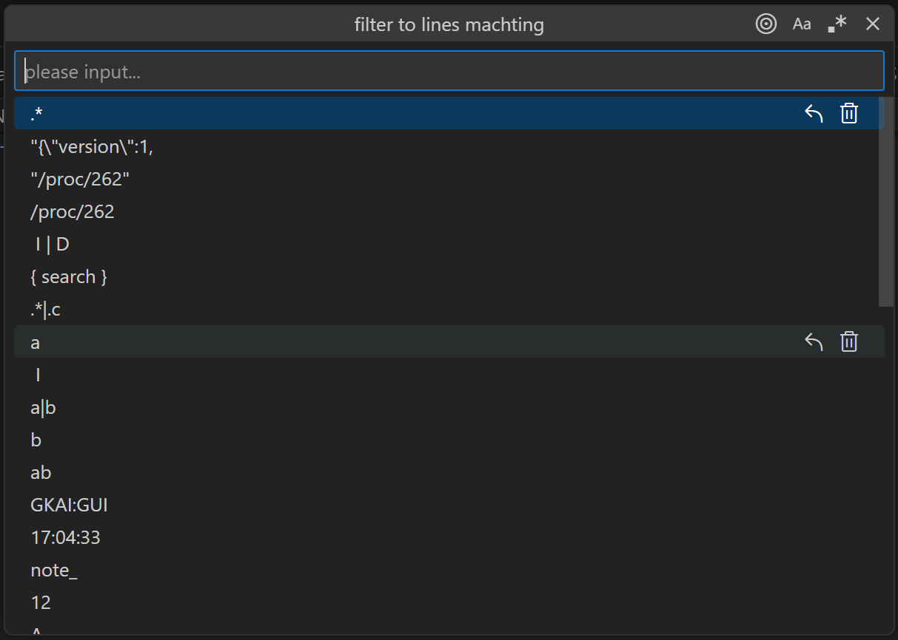
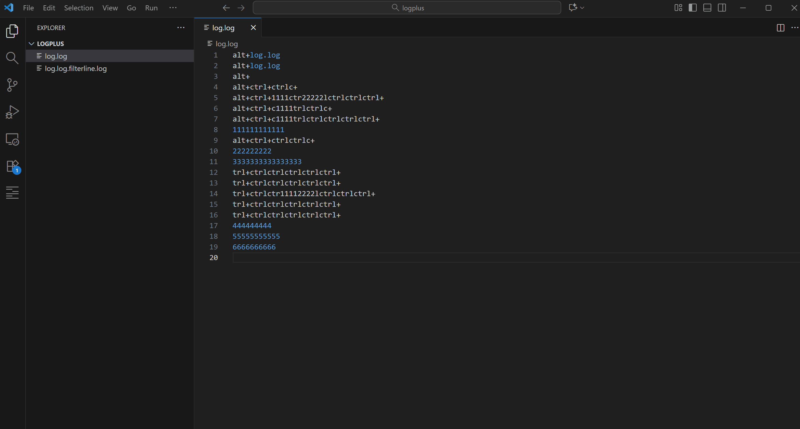
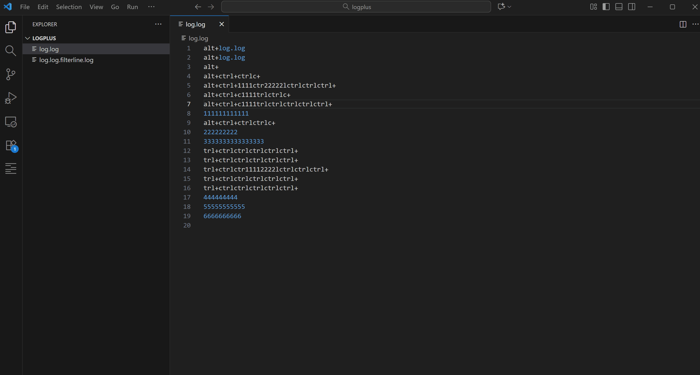
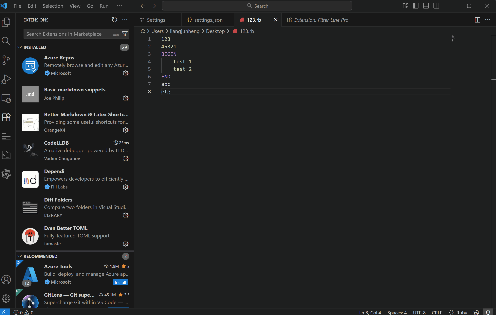
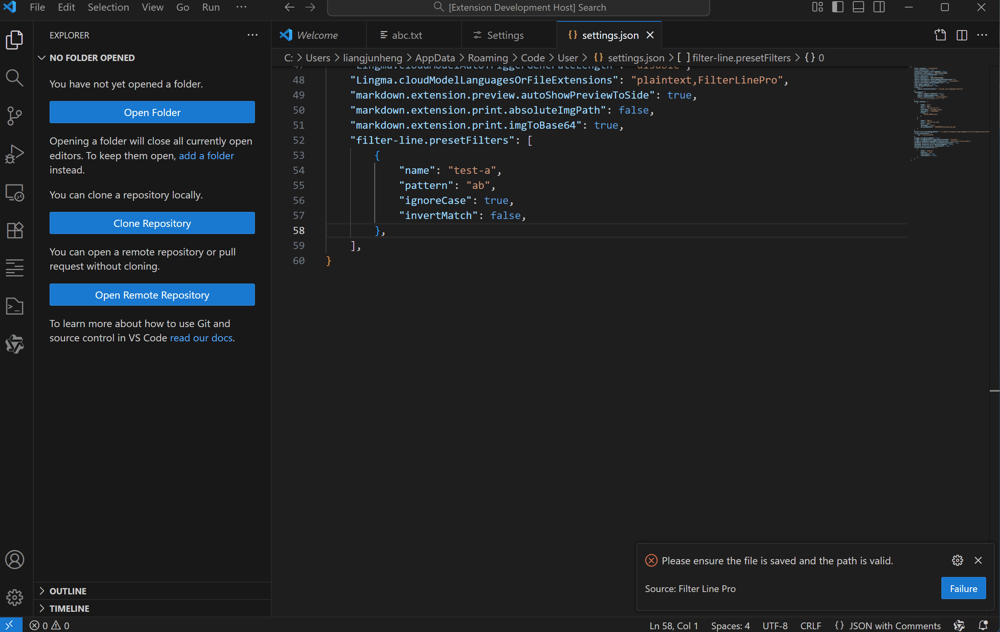

# VSCode Extension Filter Line

Filter line for current opening file by strings/regular expressions, generating the result in a new file.
Commonly used for log analysis.

*🌟Warning: Some features depend on **[ripgrep](https://github.com/BurntSushi/ripgrep)**. Add **[ripgrep](https://github.com/BurntSushi/ripgrep)** to **SYSTEM PATH** only if those features aren't working.*

## **Features**
1. Filter line by input string (or not contain input string).
2. Filter line by input regular expression (or not match input regular expression).
3. Support large file filter
4. Support folder filte line
5. Support showing context lines in the filter line view
6. Support multiline matching when regex expressions include '(?s)', for example: (?s)BEGIN.*?END
7. Support input history cloud sync
8. Support preset filter rules 
---

## Usage
1. Alt + F: filter to lines machting
2. Alt + Shift + F： filter to lines not machting
3. F12：display surrounding lines of the selected target line

### 1. Large file mode
* Perfect support large file filter, but ensure the file is saved before proceeding.

### 2. Support folder filte line.
1. show context menu

### 3. Filter line by input string.
1. Alt + F: filter to lines machting
2. Type a string and hit `<Enter>`.

### 4. Filter line by input regex.
1. Alt + F: filter to lines machting
2. Type a regular expression and hit `<Enter>`.

### 5. Support showing context lines in the filter line view.
1. Line currently targeted for selection
2. F12: Display surrounding lines of the selected target line

### 6. Support multiline matching when regex expressions include '(?s)', for example: (?s)BEGIN.*?END
1. regex expressions include '(?s)'

### 7. Support preset filter rules 
1. show context menu
